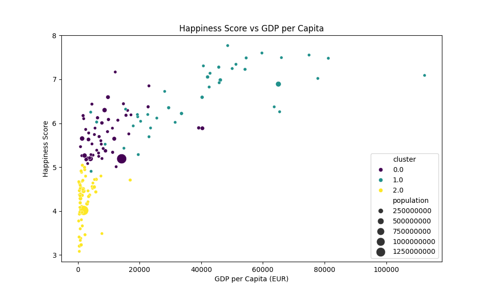

# Country Analysis Report: Happiness, GDP, and Currency Strength

*Generated on: 2025-03-13 00:53*

## 1. Introduction

This report analyzes the relationships between happiness scores, GDP per capita, and currency strength across different countries. The analysis aims to answer the research question:

> "How do happiness, GDP, and currency strength relate to each other?"

## 2. Data Overview

The analysis includes data from **196** countries worldwide. The dataset contains the following key metrics:

- **Happiness Score**: World Happiness Report scores (scale of 0-10)
- **GDP per Capita (EUR)**: Gross Domestic Product per person in Euros
- **Exchange Rate to EUR**: Currency strength relative to the Euro

### 2.1 Data Availability

| Metric | Available Countries | Percentage |
|--------|---------------------|------------|
| happiness_score | 153/196 | 78.1% |
| gdp_per_capita_eur | 192/196 | 98.0% |
| exchange_rate_eur | 195/196 | 99.5% |

## 3. Summary Statistics

### 3.1 Basic Statistics

```
       happiness_score  gdp_per_capita_eur    population  exchange_rate_eur
count       153.000000          192.000000  1.960000e+02         195.000000
mean          5.415418        15657.784145  3.963772e+07           0.324102
std           1.119830        25244.125957  1.453661e+08           0.482451
min           2.853000          253.333644  1.083400e+04           0.000010
25%           4.548000         1891.536410  2.094378e+06           0.002676
50%           5.386000         5872.721703  8.932116e+06           0.050478
75%           6.192000        17351.135196  2.861116e+07           0.559989
max           7.769000       183081.342192  1.402112e+09           2.981568
```

### 3.2 Key Observations

- The average happiness score across countries is **5.42** (on a scale of 0-10).
- Happiness scores range from **2.85** to **7.77**.
- The average GDP per capita is **€15,657.78**.
- The highest GDP per capita is **€183,081.34**.

## 4. Correlation Analysis

### 4.1 Correlation Matrix

```
                    happiness_score  gdp_per_capita_eur  exchange_rate_eur
happiness_score            1.000000            0.736695           0.458001
gdp_per_capita_eur         0.736695            1.000000           0.435357
exchange_rate_eur          0.458001            0.435357           1.000000
```

### 4.2 Interpretation

- **Happiness and GDP per Capita**: Correlation coefficient = **0.737**
  - There is a strong positive correlation between happiness and GDP per capita.
  - Countries with higher GDP per capita tend to report higher happiness scores.

- **Happiness and Exchange Rate**: Correlation coefficient = **0.458**
  - There is a moderate positive correlation between happiness and currency exchange rate.
  - Countries with stronger currencies (higher EUR exchange rates) tend to have higher happiness scores.

- **GDP per Capita and Exchange Rate**: Correlation coefficient = **0.435**
  - There is a moderate relationship between GDP per capita and currency strength.

## 5. Cluster Analysis

K-means clustering was applied to identify natural groupings in the data based on happiness, GDP per capita, and exchange rates.

### 5.1 Cluster Characteristics

| Cluster | Count | Avg Happiness | Avg GDP per Capita (EUR) | Avg Exchange Rate |
|---------|-------|---------------|--------------------------|------------------|
| 0 | 52 | 5.74 | 9,209.37 | 0.0905 |
| 1 | 41 | 6.59 | 39,983.18 | 0.9056 |
| 2 | 55 | 4.26 | 2,358.99 | 0.0219 |

### 5.2 Cluster Interpretation

**Cluster 0**: This group represents countries with high happiness scores and less wealthy economies.
- **Notable countries**: China, Indonesia, Pakistan
- **Average happiness score**: 5.74
- **Average GDP per capita**: €9,209.37
- **Average exchange rate**: 0.0905

**Cluster 1**: This group represents countries with high happiness scores and wealthy economies.
- **Notable countries**: United States, Germany, France
- **Average happiness score**: 6.59
- **Average GDP per capita**: €39,983.18
- **Average exchange rate**: 0.9056

**Cluster 2**: This group represents countries with lower happiness scores and less wealthy economies.
- **Notable countries**: India, Bangladesh, Ethiopia
- **Average happiness score**: 4.26
- **Average GDP per capita**: €2,358.99
- **Average exchange rate**: 0.0219

### 5.3 Visualization



*Figure: Scatter plot showing happiness scores vs GDP per capita, colored by cluster assignment.*

## 6. Conclusions

1. **Economic prosperity correlates with happiness**: The data shows a significant positive correlation between GDP per capita and happiness scores, suggesting that economic well-being is an important factor in overall life satisfaction.

2. **Currency strength appears relevant to happiness**: Countries with stronger currencies relative to the Euro tend to report higher happiness levels, which may reflect broader economic stability.

3. **Multiple factors influence happiness**: The clustering analysis reveals distinct groups of countries with different combinations of economic prosperity and happiness levels, showing that the relationship between wealth and happiness is complex and multifaceted.

4. **Future research directions**: Further investigation could explore additional factors like income inequality, social support systems, healthcare access, and political freedom, which might explain variations in happiness that aren't accounted for by economic indicators alone.

## 7. Methodology

This analysis was conducted using the following steps:

1. Data was loaded from normalized country datasets containing happiness scores, economic indicators, and currency exchange rates.
2. Relevant metrics were extracted and cleaned for analysis.
3. Descriptive statistics and correlations were calculated to identify relationships between variables.
4. K-means clustering was applied to identify natural groupings in the data.
5. Results were visualized and interpreted to draw conclusions about the relationships between happiness, GDP, and currency strength.

*End of Report*
